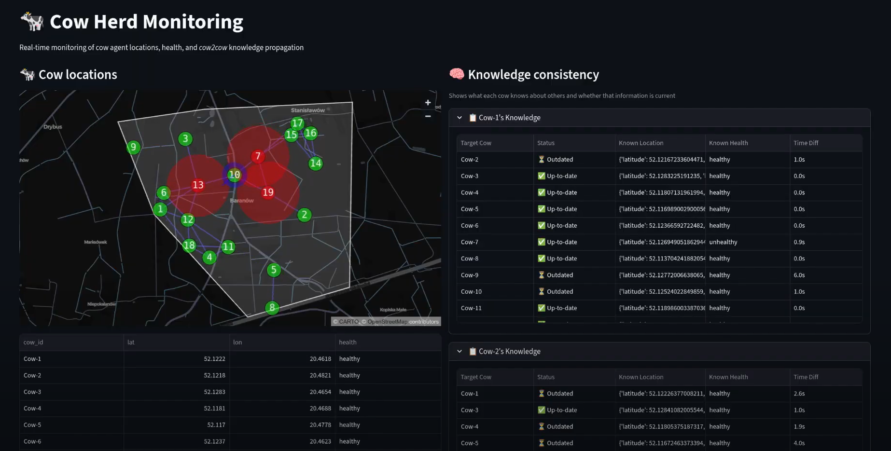
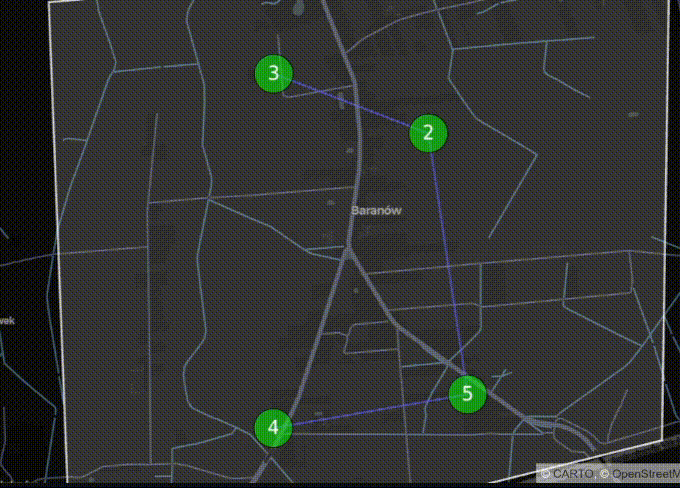
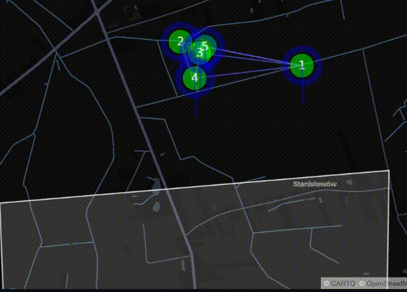
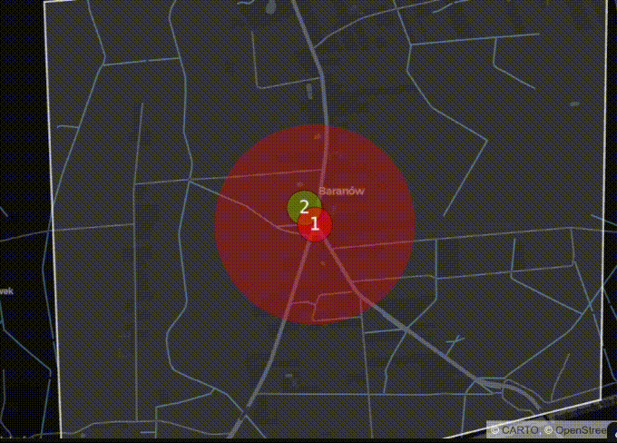
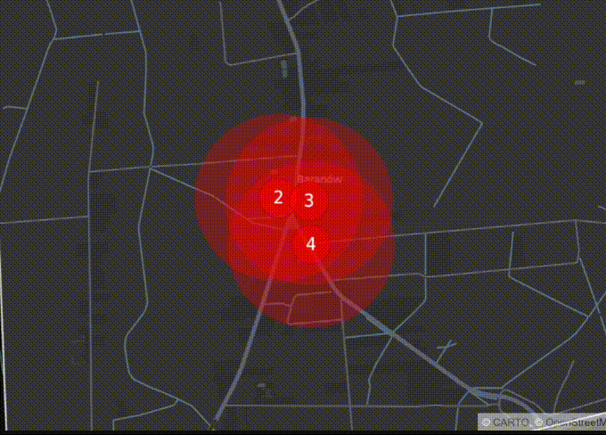
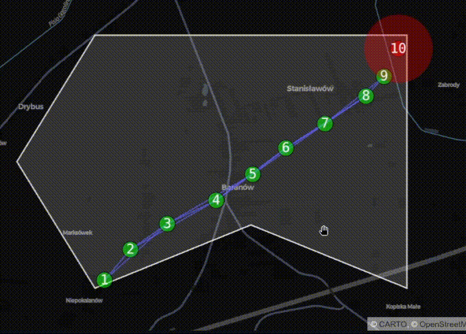

# Multi-Agent Herd Monitor

A multi-agent system for monitoring livestock herds and detecting potential disease outbreaks.  
The system models each animal as an autonomous agent equipped with sensors and communication capabilities. Agents cooperate to monitor health parameters, propagate state information across the herd, and enforce spatial constraints defined by a shepherd agent.

The project demonstrates the application of **agent-based systems**, **distributed communication**, and **geofencing** for herd management.

---

# Problem Description

Large livestock herds are vulnerable to rapid disease propagation. Early detection and isolation of infected individuals is crucial to prevent outbreaks and minimize economic losses.

Traditional monitoring methods are often insufficient for large-scale herds. This project proposes a **distributed monitoring system**, where each animal is equipped with a smart collar acting as an autonomous software agent.

The system continuously monitors:

- animal health parameters
- spatial distribution of the herd
- proximity between animals
- environmental constraints

When abnormal conditions are detected, the system can dynamically adjust the movement of animals and isolate potentially infected individuals.

---

# Visualization

On the screenshot, you can see the system control panel. The shepherd can define the area where the cows are allowed to move. The smart collar system is intended to keep them within that designated area and prevent the spread of disease.

The system provides a **Streamlit dashboard** that displays:

- real-time map of cow positions
- health status of each cow
- current knowledge of each agent
- state synchronization between agents

Color coding:

- Green — healthy cow
- Red — infected cow

Additional tables display:

- herd state data
- knowledge maintained by each agent
- synchronization status

The movement of the cows is simulated based on their natural behavior. Healthy agents tend to form herds.

If an agent representing a single cow moves outside the boundaries set by the shepherd, the agent will calculate a direction vector determining the fastest route back to the area designated by the shepherd.

If a CowAgent detects that a particular cow is sick, it notifies the other agents. The AI agents then control the herd's formation to ensure that healthy cows maintain a proper distance from the infected individual.

To prevent the spread of various diseases, sick cows also distance themselves from one another to isolate the infection until the individual cow has recovered.

The GIF above shows a simulation where the cows are arranged in a straight line. It simulates the emergence of a new disease, allowing the observer to track the agents' behavior in response to the outbreak.

# System Architecture

The system is based on a **multi-agent architecture** consisting of two main agent types.

## CowAgent

Represents an individual cow equipped with a smart collar.

Responsibilities:

- monitoring health parameters
- tracking geographic position
- exchanging state information with neighboring cows
- reacting to infection threats
- navigating within allowed areas

Each `CowAgent` contains several role-based behaviours.

| Role | Description |
|------|-------------|
| CowHealthChecker | Monitors health parameters and detects anomalies |
| CowPositionLocalizer | Tracks the cow's position and guides movement |
| MapGenerator | Generates navigation maps based on herd state |
| InterCowCommunicator | Exchanges information with neighboring agents |

---

## ShepherdAgent

Represents the entity responsible for defining global spatial constraints.

Responsibilities:

- defining herd movement boundaries (virtual fence)
- updating spatial constraints
- distributing boundary information to cow agents

---

# Technologies

The system is implemented using the following technologies.

| Component | Technology |
|-----------|------------|
| Agent framework | SPADE (Python) |
| Communication protocol | XMPP |
| Visualization | Streamlit |
| Data format | JSON |

---

# Agent Implementation

Agents are implemented as Python classes that inherit from:

    spade.agent.Agent

Each agent role is implemented using SPADE behaviours such as:

- CyclicBehaviour
- PeriodicBehaviour

Roles are implemented as nested classes inside agent classes.

Conceptual structure:

    CowAgent
    ├── CowHealthCheckerBehaviour
    ├── CowPositionLocalizerBehaviour
    ├── MapGeneratorBehaviour
    └── InterCowCommunicatorBehaviour

Each role may consist of multiple behaviours.  
For example, the InterCowCommunicator role contains separate behaviours for sending and receiving state updates.

---

# Communication Model

Agents communicate using SPADE's built-in messaging functions:

- send()
- receive()

Messages follow the **FIPA Agent Communication Language (ACL)** standard and contain metadata such as:

- sender
- receiver
- performative
- language
- ontology
- message body

Example message creation:

    propagate_msg = Message(to=peer_jid)
    propagate_msg.set_metadata("performative", "inform")
    propagate_msg.set_metadata("ontology", "cow_state")

---

# Message Types

The following messages are exchanged between agents.

| Sender | Receiver | Performative | Ontology | Description |
|--------|----------|--------------|----------|-------------|
| CowAgent | CowAgent | INFORM | CowState | Propagation of the herd state |
| CowAgent | CowAgent | SUBSCRIBE | CowsNearby | Subscription to nearby cows |
| ShepherdAgent | CowAgent | INFORM | GlobalBoundaries | Definition of movement boundaries |

Message content is encoded using JSON.

---

# Communication Protocol

The system implements the **FIPA Subscribe Interaction Protocol**.

This protocol allows agents to subscribe to updates from other agents.  
When the state of a subscribed agent changes, subscribers automatically receive an update.

Example usage:

- a CowAgent subscribes to nearby cows
- whenever their state changes, updates are propagated through the network

---

# State Propagation

Agents exchange information about the herd state, including:

- cow positions
- cow health status

Communication occurs in a mesh-like network with limited communication range.

State propagation process:

1. An agent detects a local state change (position or health).
2. The agent broadcasts its knowledge of the herd state to nearby agents.
3. Received states are merged using timestamp comparison.
4. If the merged state differs from the current state, the update is propagated further.
5. Propagation stops when no new information is discovered.

To prevent loops:

- messages are not sent back to the sender of the previous message.

---

# Movement Control

Movement of cows is controlled by a cyclic behaviour inside CowAgent.

The movement algorithm follows a priority-based decision model.

## Priority 1 — Stay within global boundaries

If a cow leaves the allowed area defined by the ShepherdAgent, it is guided back to the nearest valid position inside the boundary.

---

## Priority 2 — Avoid infection zones

If a cow is located within the infection radius of an infected cow:

- a movement vector away from the infected cow is computed
- if this movement would leave the allowed boundary, it is rejected

The system then performs up to **12 attempts**, rotating the movement vector by **30 degrees** each time to find a valid direction.

If no direction is valid, the cow moves toward the nearest boundary edge.

---

## Priority 3 — Natural herd movement

If no constraints apply, cows move according to a herd cohesion model.

Cows tend to move toward the center of nearby healthy cows while maintaining separation.

---

# XMPP Server

The system uses the **XMPP server provided by SPADE**.

During development an issue was encountered where agents defined in different files could not communicate when using the internal SPADE server.

This was resolved by running an **external XMPP server**, which enabled proper message routing between agents.

---

# Future Improvements

Possible extensions of the system include:

- integration with real sensor data
- drone-based monitoring
- predictive disease modeling
- integration with weather and environmental data
- large-scale distributed simulations
